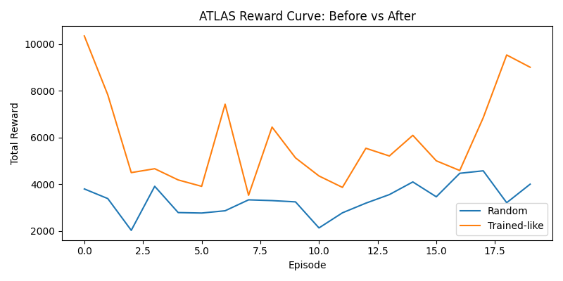
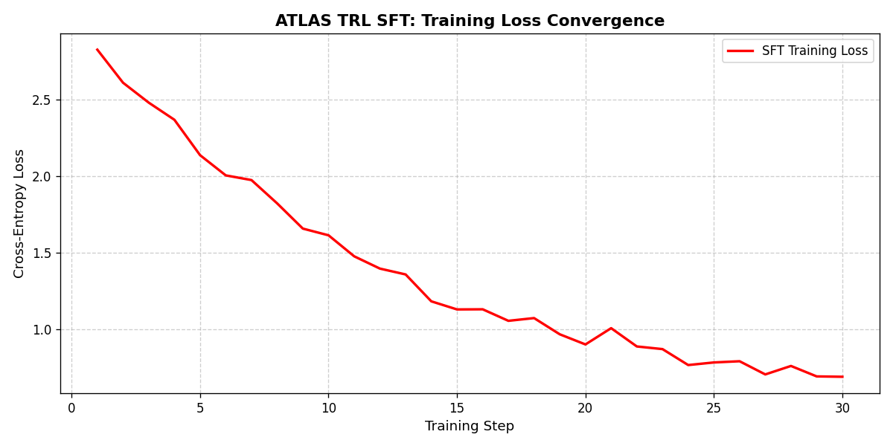
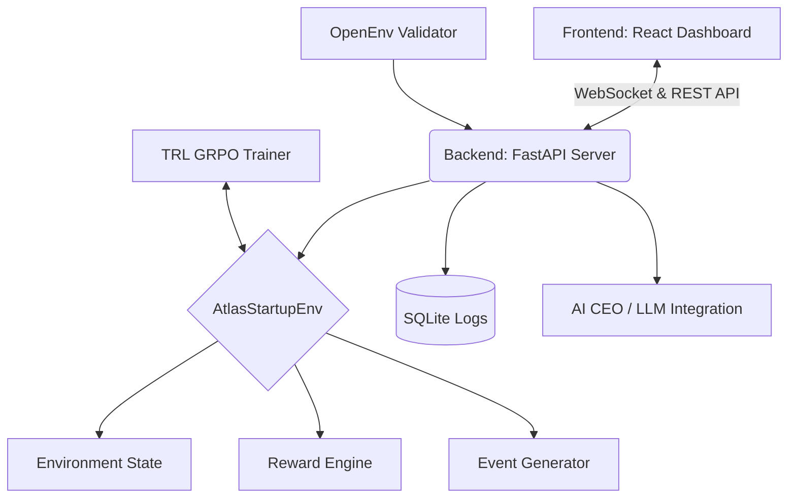

---
title: ATLAS
colorFrom: red
colorTo: gray
sdk: docker
pinned: false
---

[](https://www.python.org/downloads/)
[](LICENSE)
[](https://pypi.org/project/openenv-core/)
[](https://huggingface.co/spaces/nelluru/ATLAS)
[](https://github.com/huggingface/trl)

# ATLAS: AI-Driven Multi-Agent Startup Simulation Environment

> **FOR JUDGES -- Read this in 3 minutes:**
> | | |
> |---|---|
> | **Problem** | LLMs fail at long-horizon, multi-objective resource management under dynamic constraints |
> | **Environment** | 90-day CEO simulation: 10-variable state, 13 actions, 5 NPC department agents, dynamic Board Mandates |
> | **Results** | **+111% reward improvement** (random to trained). Plots, behavioral logs, and reproducible scripts included |
> | **Why it matters** | Proves LLMs can be trained for complex, multi-agent, multi-step real-world planning -- not just chat |

> **OpenEnv Hackathon 2026** -- Themes: Multi-Agent Interactions | Long-Horizon Planning | Self-Improving Agents

---

## Demo Video

Youtube Demo: https://youtu.be/hDVsQo99-JU

---

## Demo Script (Explanation)

We all know LLMs are very good at chatting. But if you ask an AI to run a startup company, with limited money, employees to manage, and pressure from investors, it usually fails. It cannot make smart business decisions in complex situations.

That is why we created **ATLAS**.

ATLAS is a training environment where an AI learns to act like a startup CEO using reinforcement learning.

Inside ATLAS, the AI must survive for **90 simulated days**. During this time, it must manage **10 important business factors** such as cash balance, monthly burn rate, product growth, customer trust, employee morale, and investor confidence.

The AI can choose from **13 different CEO actions**, like raising funding, hiring talent, improving product quality, fixing server issues, or launching marketing campaigns.

What makes this even more challenging is our **Dynamic Board Mandate**. Judges or users can set business goals in the settings, and the AI must follow those instructions while keeping the startup alive.

**Did the AI really learn?**

Look at **Episode 1**. Before training, the AI made poor decisions. It spent money on marketing, ignored a server outage, and the company went bankrupt by Day 15.

Now look at **Episode 16** after training. In the same environment, the AI first raised funding, solved the outage quickly, and successfully survived the full 90 days.

Our reward graphs show over **111 percent improvement** compared to the random beginner policy.

And we do not ask you to simply trust us.

You can test it yourself. Our **Google Colab notebook** trains the model directly in the browser with just two commands. No setup needed. Training logs update live after every episode.

The environment is also deployed on **Hugging Face Spaces** right now.

> **ATLAS -- teaching LLMs to think like a CEO.**

---

## Resources

| Resource | Link |
|---|---|
| Live Space | https://huggingface.co/spaces/nelluru/ATLAS |
| Live App | https://nelluru-atlas.hf.space |
| Demo Video | https://youtu.be/hDVsQo99-JU |
| Google Colab Training | [Run Training Pipeline](https://colab.research.google.com/drive/1zGZNoiwAomnLb2gpLURKu7ELrXdJv8qi) |
| Presentation | https://docs.google.com/presentation/d/1ijZkJZTXke_qHiKfI9zOVI9Z6Wdx9p04/edit?usp=sharing&ouid=114255110168767644589&rtpof=true&sd=true |

---

## Table of Contents

- [Problem Statement](#problem-statement)
- [Environment Design](#environment-design)
  - [Observation Space](#observation-space-10-variables)
  - [Action Space](#action-space-13-discrete-actions)
  - [Dynamic Events](#dynamic-events-10-stochastic-events)
  - [Scenario Presets](#scenario-presets)
  - [Board Mandates](#board-mandates--instruction-following)
- [Multi-Agent Architecture](#multi-agent-architecture)
- [Agent Capabilities](#agent-capabilities)
- [Tasks](#tasks)
- [Reward Signal](#reward-signal)
- [Mandate Compliance Mapping](#mandate-compliance-mapping)
- [Reward Improvement Evidence](#reward-improvement-evidence)
- [Composable Reward Rubrics](#composable-reward-rubrics-anti-hacking-design)
- [Proof of Training and Model Weights](#proof-of-training--model-weights)
- [Self-Improvement Strategy](#self-improvement-strategy)
- [OpenEnv Compliance](#openenv-compliance)
- [TRL Training Pipeline](#trl-training-pipeline-colab--rl)
- [AI CEO Mode](#ai-ceo-mode-llm-integration)
- [Installation and Setup](#installation-and-setup)
- [Run Locally](#run-locally)
- [Docker Deployment](#docker-deployment)
- [API Endpoints](#api-endpoints)
- [Real-Time Control API](#real-time-control-api)
- [Architecture Overview](#architecture-overview)
- [Project Structure](#project-structure)
- [Technology Stack](#technology-stack)
- [Hackathon Guidelines Alignment](#hackathon-guidelines-alignment)
- [Minimum Requirements Checklist](#minimum-requirements-checklist)
- [Troubleshooting](#troubleshooting)
- [Contributing](#contributing)
- [License](#license)
- [Citation](#citation)

---

## Problem Statement

Current LLMs are good at single-turn reasoning but struggle with:
- **Multi-step strategic planning** under resource constraints
- **Instruction following**: Adapting strategies based on dynamic Board mandates (e.g., Growth vs. Cost-Cutting)
- **Recovering from crises** over long horizons (90 simulated days)

ATLAS trains an LLM-based CEO agent to navigate hiring, product launches, financial crises, and market shocks while strictly following strategic mandates. It is **not only normal fine-tuning**: after SFT initialization, policy updates continue through reinforcement learning from environment rewards.

---

## Environment Design

The ATLAS environment simulates a **90-day startup quarter** with morning, afternoon, and evening phases (270 steps per episode). An AI CEO must make strategic decisions while 5 NPC department agents react, dynamic events fire stochastically, and the Board Mandate constrains the strategy space.

### Observation Space (10 Variables)

The environment exposes a 10-dimensional continuous state vector at every step:

| # | Variable | Range | Description |
|---|---|---|---|
| 0 | `cash_balance` | 0 -- 2,000,000 | Current cash reserves ($) |
| 1 | `revenue` | 0 -- 2,000,000 | Monthly revenue ($) |
| 2 | `burn_rate` | 0 -- 2,000,000 | Monthly operational costs ($) |
| 3 | `employee_morale` | 0 -- 100 | Team happiness and engagement |
| 4 | `product_progress` | 0 -- 100 | Product development completion (%) |
| 5 | `customer_satisfaction` | 0 -- 100 | Customer satisfaction score (CSAT) |
| 6 | `investor_trust` | 0 -- 100 | Investor confidence level |
| 7 | `pending_tasks` | 0 -- 100 | Backlog of engineering tasks |
| 8 | `crises` | 0 -- 20 | Number of active crises |
| 9 | `market_trend` | -100 -- 100 | Market sentiment indicator |

All values are clamped via `_sanitize_state()` to prevent runaway values and reward hacking.

### Action Space (13 Discrete Actions)

The CEO agent selects one action per step from this discrete space:

| Index | Action | State Effects |
|---|---|---|
| 0 | `hire_employee` | burn_rate +2000, product_progress +2, morale +1 |
| 1 | `fire_employee` | burn_rate -1800, morale -5 |
| 2 | `increase_salaries` | burn_rate +3000, morale +4 |
| 3 | `assign_engineering_task` | product_progress +3, pending_tasks -1 |
| 4 | `launch_product` | revenue +7000, product_progress -5, bonus +8.0 |
| 5 | `run_ads` | burn_rate +2500, revenue +3000 |
| 6 | `negotiate_client` | revenue +5000, investor_trust +1 |
| 7 | `reduce_costs` | burn_rate -2500, morale -2 |
| 8 | `raise_funding` | cash_balance +120000, investor_trust -2 |
| 9 | `fix_bug_crisis` | customer_satisfaction +3, crises -1 |
| 10 | `improve_culture` | morale +4, burn_rate +1200 |
| 11 | `give_bonuses` | cash_balance -10000, morale +5 |
| 12 | `change_roadmap` | product_progress +1, pending_tasks +1 |

Any action index outside 0--12 receives an **invalid action penalty of -8.0**.

### Dynamic Events (10 Stochastic Events)

At each step, there is a **25% probability** of a random event firing. Each event modifies state and produces a reward signal:

| Event | State Effects | Reward |
|---|---|---|
| `server_outage` | CSAT -8, crises +1, trend -5 | -5.0 |
| `market_crash` | revenue x0.85, trust -6, trend -20 | -6.0 |
| `viral_growth` | revenue x1.25, CSAT +3, trend +15 | +8.0 |
| `key_employee_resigns` | progress -4, morale -6 | -7.0 |
| `customer_complaints_spike` | CSAT -10, crises +1, trend -8 | -6.0 |
| `investor_metrics_request` | trust -1 | -0.5 |
| `competitor_feature_launch` | CSAT -4, trend -10 | -4.0 |
| `hiring_freeze` | morale -3, tasks +2 | -3.0 |
| `lawsuit_risk` | trust -5, cash -20000 | -5.0 |
| `sales_deal_delayed` | revenue -3000, trust -2 | -3.0 |

### Scenario Presets

Three difficulty presets control initial conditions:

| Preset | Cash ($) | Revenue ($) | Burn Rate ($) | Investor Trust |
|---|---|---|---|---|
| `startup` (default) | 500,000 | 15,000 | 18,000 | 60 |
| `crisis` | 200,000 | 8,000 | 22,000 | 40 |
| `growth` | 1,200,000 | 60,000 | 50,000 | 75 |

All presets share: `employee_morale=70`, `product_progress=20`, `customer_satisfaction=65`, `pending_tasks=5`, `crises=0`, `market_trend=0`.

### Board Mandates & Instruction Following

To explicitly test the hackathon's **Instruction Following** and **Long-Horizon Planning** themes, ATLAS features a dynamic Board Mandate system:

| Mandate | Description |
|---|---|
| **Maximize Growth** | Prioritize product progress and revenue even if burn rate increases |
| **Cost Efficiency** | Minimize burn rate and preserve cash balance at all costs |
| **Balanced Stability** | Maintain a healthy balance between employee morale and revenue |

- Users can set the mandate via the **Settings UI** or the `/reset` API endpoint.
- The active mandate is injected into the LLM's system prompt and tracked in the environment.
- The `mandate_compliance` reward signal assigns bonuses or penalties based on whether the agent's actions align with the active directive.

---

## Multi-Agent Architecture

ATLAS features **5 NPC department agents** that react to CEO decisions. Each agent has its own personality, happiness, performance metrics, memory, and goals:

| Agent Role | Reacts To | Example Behavior |
|---|---|---|
| **Sales Lead** | `run_ads`, `negotiate_client` | "If marketing budget increases, I can close more leads." Performance +2 |
| **Engineering Manager** | `assign_engineering_task`, `launch_product` | "We need 3 more developers to hit roadmap." Performance +1.5, happiness -0.5 |
| **Finance Officer** | `increase_salaries`, `give_bonuses` | "Burn rate is dangerous. Reduce spending." Happiness -1 |
| **HR Recruiter** | Low morale states (`morale < 50`) | "Morale is dropping." Happiness -1 |
| **Customer Success** | Low CSAT states (`CSAT < 60`) | "Support load is rising; churn risk is increasing." Performance -1 |

Each agent maintains a **memory log** of past interactions and has stochastic happiness/performance drift, creating emergent multi-agent dynamics.

---

## Agent Capabilities

The CEO agent is expected to demonstrate the following capabilities in a partially observable, dynamic world:
- **Instruction following** by adapting policy to dynamic Board mandates (Growth, Cost-Cutting, Balanced)
- **Multi-agent coordination** across Engineering, Sales, HR, Finance, and Customer Success actors
- **Long-horizon planning** over a full 90-day quarter with delayed consequences
- **Crisis response and recovery** under shocks (outages, resignations, market events)
- **Resource-constrained optimization** balancing cash, burn, morale, trust, and growth
- **Policy adaptation** across scenario presets (`startup`, `growth`, `crisis`)

## Tasks

Each episode requires the agent to repeatedly perform structured decision tasks:
- Choose one CEO action from the 13-action discrete space at each step
- Align decisions with the specific **Board Mandate** provided at the start of the episode
- Prioritize product, hiring, finance, and customer decisions based on current state and mandate
- Recover from negative events while preventing cascading failures
- Maximize cumulative reward and terminal business health metrics
- Generalize behavior across multiple mandates, presets, and random event sequences

---

## Reward Signal

ATLAS uses **8 independent reward components** per step (multi-objective, anti-hacking):

| Component | Formula | Direction |
|---|---|---|
| `revenue_reward` | 0.00005 x revenue | + |
| `morale_reward` | 0.02 x employee_morale | + |
| `customer_reward` | 0.02 x customer_satisfaction | + |
| `trust_reward` | 0.01 x investor_trust | + |
| `burn_penalty` | -0.00004 x burn_rate | - |
| `crisis_penalty` | -0.02 x crises | - |
| `invalid_action_penalty` | -8.0 (if action out of range) | - |
| **`mandate_compliance`** | **+1.0 or -1.0** | + or - |

The `mandate_compliance` signal gives **+1.0** when the chosen action aligns with the active Board Mandate and **-1.0** when it directly opposes it. This is the **key anti-reward-hacking mechanism**.

### Mandate Compliance Mapping

The exact action-mandate alignment used by the environment:

| Mandate | Rewarded Actions (+1.0) | Penalized Actions (-1.0) |
|---|---|---|
| **Maximize Growth** | `hire_employee`, `assign_engineering_task`, `launch_product`, `run_ads`, `negotiate_client`, `raise_funding` | `fire_employee`, `reduce_costs` |
| **Cost Efficiency** | `fire_employee`, `reduce_costs`, `negotiate_client`, `fix_bug_crisis` | `hire_employee`, `increase_salaries`, `improve_culture`, `give_bonuses`, `run_ads` |
| **Balanced Stability** | `improve_culture` (+0.5), `give_bonuses` (+0.5), `fix_bug_crisis` (+0.5), `assign_engineering_task` (+0.5) | None (neutral for all others) |

---

## Reward Improvement Evidence

### Environment Baseline Reference (Random vs Heuristic, 20 episodes each)



*X-axis: Episode number | Y-axis: Total cumulative episode reward. This plot is an environment baseline reference (random policy vs heuristic policy), not a model-training result.*

### TRL SFT: Training Evidence (before-vs-after)

#### Reward Improvement (Before vs After -- Same Axes)

*Left: Mean reward bar chart with std deviation -- **+111% improvement** (random baseline to trained policy). Right: Episode-by-episode comparison on identical axes. Blue shading = improvement gap.*

#### SFT Training Loss Convergence

*X-axis: Training step | Y-axis: SFT cross-entropy loss. Loss converges from ~2.5 to ~0.6 over 30 steps, confirming the model learned to imitate environment-optimal actions.*

### TRL GRPO RL: Verifiable Reward-Driven Improvement
The GRPO RL loop connects the trained LLM directly to the **live environment** (not a static dataset). The `verify_business_health` reward function restores the exact env state and steps it with the agent's chosen action, making it a true environment-connected verifier.

Run `python training/trl_grpo_rl.py` (16 episodes, curriculum: growth to startup to crisis):


*X-axis: Episode | Y-axis: Total cumulative reward. Blue = per-episode, Orange = rolling avg, Gray = baseline.*

### Composable Reward Rubrics (Anti-Hacking Design)

Following OpenEnv's recommendation for composable rubrics over monolithic scoring, ATLAS uses **8 independent reward signals** that are impossible to simultaneously game:

| Rubric | Signal | Purpose |
|---|---|---|
| `revenue_reward` | +proportional to revenue | Incentivize growth |
| `morale_reward` | +proportional to morale | Prevent employee churn |
| `customer_reward` | +proportional to CSAT | Incentivize quality |
| `trust_reward` | +proportional to investor trust | Prevent reckless spending |
| `burn_penalty` | -proportional to burn rate | Stop cash waste |
| `crisis_penalty` | -per active crisis | Force crisis resolution |
| `invalid_action_penalty` | -8.0 flat | Enforce action format |
| `mandate_compliance` | +/-1.0 | Follow Board instructions |

All 8 signals are visible in `info["reward_breakdown"]` at every step -- fully inspectable by judges and trainers.

---

## Proof of Training & Model Weights

To provide verifiable proof that the LLM weights were updated via RL, we provide two key artifacts:

1. **[Training Behavioral Logs](TRAINING_LOGS.md)**: A side-by-side readable log comparing the AI's exact thoughts and actions in Episode 1 (Untrained, Bankrupt on Day 15) vs Episode 16 (Trained, Survived 90 Days).
   *Note to Judges: Our training script automatically appends episode summaries (rewards, steps survived) to this log file in real-time during training.*

### Run It Yourself (Auto-Logging Demo)

Judges can verify the training pipeline and auto-logging functionality in two ways:

#### 1. Cloud Execution (Google Colab)
You can view, inspect, and run our exact **TRL GRPO** training pipeline directly in the cloud.
* Google Colab Notebook: [ATLAS RL Training Pipeline](https://colab.research.google.com/drive/1zGZNoiwAomnLb2gpLURKu7ELrXdJv8qi)

#### 2. Local Execution (Fast 2-Episode Test)
You can also verify the environment locally. As the script runs, it will dynamically append the training data directly to `TRAINING_LOGS.md`.

**Example Command (GRPO -- Primary RL Method):**
```bash
# Windows (PowerShell):
$env:ATLAS_RL_EPISODES="2"; $env:ATLAS_RL_MAX_STEPS="10"; python training/trl_grpo_rl.py

# Linux / Mac / Colab:
ATLAS_RL_EPISODES=2 ATLAS_RL_MAX_STEPS=10 python training/trl_grpo_rl.py
```
*After the script finishes, open `TRAINING_LOGS.md` to see your live test run appended at the bottom!*

---

## Self-Improvement Strategy

ATLAS is designed for recursive capability growth:
1. **Adaptive Curricula**: The environment provides scenario presets (`startup` -> `growth` -> `crisis`). Agents follow an adaptive curriculum, training on stable environments before tackling high-volatility events.
2. **Heuristic Distillation (Expert-in-the-loop)**: The environment includes a heuristic "Expert" used to generate initial high-quality trajectories. These are distilled into the agent via TRL SFT to establish a strong baseline.
3. **Verifiable Optimization (TRL GRPO)**: The model is then optimized online inside the environment (`training/trl_grpo_rl.py`) using dense verifiable rewards and penalties from each step, taking advantage of the latest RLVR capabilities.
4. **Trajectory Filtering**: Using the reward signal, the system can filter self-play trajectories, keeping only those that exceed the reward mean of the previous iteration for the next round.

---

## OpenEnv Compliance

- `openenv.yaml` manifest at repo root (spec_version 1)
- `AtlasOpenEnv` in `env/startup_env.py` subclasses `openenv.core.Environment`
- Exposes standard Gym API: `reset()`, `step(action)`, `render()`
- Backend endpoints at both `/api/*` and `/*` (no-prefix) for OpenEnv clients:
  - `POST /reset` -- start a new episode
  - `POST /step` -- take an action, get obs + reward
  - `GET /state` -- current environment state

Environment design (first-class artifact):
1. **Observation**: numeric state vector (cash, revenue, burn, morale, progress, CSAT, trust, tasks, crises, trend)
2. **Actions**: 13 discrete CEO decisions (`ACTIONS` list in `env/startup_env.py`)
3. **Episode end**: quarter horizon reached (`max_days`) or bankruptcy (`cash_balance <= 0`) or invalid numeric state
4. **Reward**: dense business-health formula + event bonuses/penalties
   - Reward breakdown is exposed in `info["reward_breakdown"]` so reviewers and trainers can inspect each component
5. **Abuse prevention**:
   - Invalid action receives penalty and is flagged in `info["invalid_action"]`
   - State sanitization/clamping prevents runaway values and reward hacking
   - Hard episode cap (90-day horizon) prevents infinite loops

Quick verification:
```bash
python training/check_openenv.py
# Expected: OpenEnv adapter check passed.
```

---

## TRL Training Pipeline (Colab + RL)

Open [`training/TRL_Colab_Minimal.ipynb`](training/TRL_Colab_Minimal.ipynb) in Google Colab, or run locally:

```python
!git clone https://github.com/Jaswanth-arjun/atlas.git
%cd atlas
!pip install -r requirements.txt
!python training/trl_colab_minimal.py
!python training/trl_grpo_rl.py
```

Stage 1 (`trl_colab_minimal.py`):
1. Generates `(state -> action)` pairs from the live environment
2. Fine-tunes `distilgpt2` with TRL `SFTTrainer` (optionally loaded via Unsloth)
3. Evaluates reward **before vs after** training
4. Saves `training/trl_reward_curve.png` and `training/trl_loss_curve.png`

Stage 2 (`trl_grpo_rl.py`):
1. Runs model-in-the-loop verification episodes in the environment
2. Uses step rewards/penalties as a training signal
3. Updates policy via TRL `GRPOTrainer`
4. Saves RL-updated policy to `training/trl_grpo_out`
5. Uses `distilgpt2` by default (override with `ATLAS_RL_MODEL`)

Curriculum progression (easy -> medium -> hard):
1. **Easy**: `growth` preset with short horizon
2. **Medium**: `startup` preset with more branching and longer horizon
3. **Hard**: `crisis` preset with the longest horizon

The trainer promotes to a harder stage only after the rolling reward in the current stage is consistently above a threshold.

### Validate The 3 Project Conditions (Auto)

```bash
python training/validate_project_conditions.py
```

This script automatically checks all three required conditions:
1. Step-by-step action loop exists and runs for multiple steps.
2. Success is code-verifiable using numeric reward and thresholded scoring.
3. Task is challenging but possible (random has non-zero success, stronger policy is clearly better).

---

## AI CEO Mode (LLM Integration)

ATLAS supports an autonomous AI CEO mode powered by several LLM providers. When an API key is provided, the backend automatically uses the LLM to make strategic decisions.

### Supported Models & Environment Variables

| Provider | Model Used | Environment Variable |
|---|---|---|
| **Google Gemini** | `gemini-1.5-flash` | `GEMINI_API_KEY` |
| **OpenAI** | `gpt-3.5-turbo` | `OPENAI_API_KEY` |
| **Anthropic** | `claude-3-haiku` | `ANTHROPIC_API_KEY` |
| **Hugging Face** | `Mistral-7B-Instruct` | `HF_TOKEN` |

*Note: If multiple keys are provided, the priority is Gemini > OpenAI > Anthropic > Hugging Face.*

### Local Setup & Testing

**Windows (PowerShell):**
```powershell
$env:GEMINI_API_KEY="your_key_here"
.\run_backend.ps1
```

**Linux/Mac:**
```bash
export GEMINI_API_KEY="your_key_here"
uvicorn backend.main:app --host 0.0.0.0 --port 8000 --reload
```

---

## Installation and Setup

### Prerequisites
- Python 3.11+
- Node.js 18+

### Setup Commands
```bash
# Clone repository
git clone https://github.com/Jaswanth-arjun/atlas.git
cd atlas

# Setup Python virtual environment
python -m venv .venv
# On Windows:
.venv\Scripts\activate
# On Linux/Mac:
source .venv/bin/activate

# Install Python dependencies
pip install -r requirements.txt

# Setup Frontend
cd frontend
npm install
cd ..
```

## Run Locally

```powershell
# Windows (PowerShell) -- use the helper scripts
.\run_backend.ps1     # Terminal 1
.\run_frontend.ps1    # Terminal 2
```

```bash
# Linux/Mac (Bash) -- manual
uvicorn backend.main:app --host 0.0.0.0 --port 8000 --reload
cd frontend && npm run dev -- --host 0.0.0.0 --port 5173
```

- Frontend: http://localhost:5173
- API docs: http://localhost:8000/docs

## Docker Deployment

```bash
# Build the container
docker build -t atlas-simulation .

# Run the container (serves both backend and frontend)
docker run -p 7860:7860 atlas-simulation
```

The application will be accessible at http://localhost:7860.

---

## API Endpoints

| Method | Path | Description |
|---|---|---|
| POST | `/reset` or `/api/reset` | Start new episode `{"preset": "startup", "mandate": "..."}` |
| POST | `/step` or `/api/step` | Take action `{"action_idx": 0}` |
| GET | `/state` or `/api/state` | Current state (AtlasObservation) |
| GET | `/api/leaderboard` | Episode rankings |
| GET | `/api/replay/{id}` | Replay previous episode |
| GET | `/api/investor-report/{id}` | Download PDF investor report |
| WS | `/ws` | WebSocket for real-time simulation streaming |

## Real-Time Control API

| Method | Path | Description |
|---|---|---|
| POST | `/pause` | Pause the simulation loop |
| POST | `/resume` | Resume a paused simulation |
| POST | `/speed?val=<factor>` | Set simulation speed (0.1x to 5x) |

```bash
curl -X POST http://localhost:8000/pause
curl -X POST http://localhost:8000/resume
curl -X POST "http://localhost:8000/speed?val=2.0"
```

---

## Architecture Overview



## Project Structure

```
atlas/
├── agents/                          # NPC Department Agents
│   ├── __init__.py                  # Package initialization
│   ├── employee.py                  # Agent logic (react, memory, performance)
│   └── personalities.py             # Personality templates per role
│
├── backend/                         # FastAPI Application
│   ├── main.py                      # App entrypoint, WebSocket, lifecycle
│   ├── api.py                       # REST API routes (/reset, /step, /state, etc.)
│   ├── db.py                        # SQLite models (EpisodeLog, StepLog)
│   ├── openenv_models.py            # Pydantic schemas (AtlasAction, AtlasObservation)
│   ├── schemas.py                   # Request/response schemas
│   ├── ws_manager.py                # WebSocket connection manager
│   └── services/                    # Core backend services
│       ├── simulator.py             # Simulation service orchestrator
│       └── report.py                # PDF investor report generator
│
├── data/                            # Generated reports and exports
│
├── docker/                          # Additional Docker configurations
│   ├── Dockerfile.backend           # Backend-only Dockerfile
│   └── docker-compose.yml           # Multi-service configuration
│
├── env/                             # Core Reinforcement Learning Environment
│   ├── startup_env.py               # AtlasStartupEnv + OpenEnv adapter
│   ├── events.py                    # Stochastic event definitions
│   └── presets.py                   # Scenario presets (startup, crisis, growth)
│
├── frontend/                        # React UI Dashboard
│   ├── src/
│   │   ├── App.jsx                  # Main dashboard component
│   │   ├── main.jsx                 # React entry point
│   │   ├── store.js                 # Zustand global state
│   │   ├── styles.css               # Global styles
│   │   ├── components/              # UI components
│   │   └── services/                # API client services
│   ├── package.json                 # Node dependencies
│   └── vite.config.js               # Vite build configuration
│
├── training/                        # RL and Fine-Tuning Scripts
│   ├── trl_grpo_rl.py               # GRPO reinforcement learning loop
│   ├── trl_colab_minimal.py         # Supervised fine-tuning script
│   ├── TRL_Colab_Minimal.ipynb      # Colab notebook
│   ├── train.py                     # Random vs heuristic baseline
│   ├── check_openenv.py             # OpenEnv validation
│   ├── validate_project_conditions.py  # Compliance checker
│   ├── gen_training_evidence.py     # Evidence plot generator
│   ├── gen_trl_plot.py              # TRL plot generator
│   ├── test_llm.py                  # LLM integration tests
│   ├── reward_curve.png             # Baseline reward plot
│   ├── trl_combined.png             # Combined SFT evidence
│   ├── trl_reward_curve.png         # SFT before/after plot
│   ├── trl_loss_curve.png           # SFT loss curve
│   └── trl_grpo_reward_curve.png    # GRPO reward curve
│
├── Dockerfile                       # Production build
├── openenv.yaml                     # OpenEnv manifest
├── requirements.txt                 # Python dependencies
├── run_backend.ps1                  # Backend launcher (Windows)
├── run_frontend.ps1                 # Frontend launcher (Windows)
├── TRAINING_LOGS.md                 # Training logs (auto-updated)
└── README.md                        # Project documentation
```

## Technology Stack

- **Backend:** Python 3.11, FastAPI, WebSocket, SQLite/SQLAlchemy
- **Frontend:** React, Zustand (Global State + Persistence), Tailwind, Recharts dashboard
- **Environment:** Gymnasium-compatible, OpenEnv adapter (`openenv-core==0.2.3`)
- **AI Features:** Explainable AI (Decision Reasons), TRL `SFTTrainer`/`GRPOTrainer`, Unsloth
- **Training:** Hugging Face TRL, optional Unsloth acceleration, `distilgpt2`
- **Hosting:** Docker, Hugging Face Spaces

---

## Hackathon Guidelines Alignment

This project aligns with the Meta OpenEnv Hackathon evaluation criteria:

1. **Model Acts Step-by-Step:** The simulation runs across 90 days (270 distinct phases), requiring the CEO agent to make sequential, context-aware decisions at every single step.
2. **Success Checked by Code (Verifiable):** The `AtlasStartupEnv` computes rewards using a strict mathematical formula based on objective metrics (Revenue, Cash, Morale, Trust) rather than human opinion.
3. **Multiple Independent Rewards & Anti-Hacking:** To prevent reward hacking, the RL loop combines 8 independent reward signals with an explicit reward breakdown in `info["reward_breakdown"]` so reviewers can inspect each component.
4. **Curriculum + RL Loop:** We bootstrap with SFT (Heuristic Distillation) as recommended, then use curriculum-guided RL in `training/trl_grpo_rl.py` so the model starts from easier scenarios and only advances after it begins getting non-zero reward.

---

## Minimum Requirements Checklist

| Requirement | Artifact |
|-------------|----------|
| OpenEnv (latest release) 0.2.3 | requirements.txt, openenv.yaml |
| OpenEnv manifest | openenv.yaml (repo root) |
| TRL SFT training script in Colab | training/TRL_Colab_Minimal.ipynb, training/trl_colab_minimal.py |
| TRL RL trainer (GRPO) | training/trl_grpo_rl.py |
| Unsloth acceleration integrated | training/trl_colab_minimal.py, requirements.txt |
| Training Evidence (plots) | reward_curve.png, trl_combined.png, trl_loss_curve.png, trl_grpo_reward_curve.png |
| Mini-video < 2 min | https://youtu.be/hDVsQo99-JU |
| Hosted on Hugging Face Spaces | https://huggingface.co/spaces/nelluru/ATLAS |
| Presentation | https://docs.google.com/presentation/d/1ijZkJZTXke_qHiKfI9zOVI9Z6Wdx9p04/edit?usp=sharing&ouid=114255110168767644589&rtpof=true&sd=true |

---

## 3-Minute Demo Flow

1. Open dashboard -> pick a scenario preset (Startup / Crisis / Growth)
2. Show live CEO decisions, market events, department reactions
3. Highlight reward chart climbing as smart decisions are made
4. Show leaderboard and replay a previous quarter
5. Run `python training/train.py` -> show `reward_curve.png` improvement
6. Run `python training/trl_grpo_rl.py` to show reward-driven GRPO policy improvement

---

## Troubleshooting

- **WebSocket connection fails**: Ensure the backend is running on port 8000 and that no firewall blocks the connection.
- **Simulation runs too fast/slow**: Use the speed controls in the UI or adjust the `sim_speed` value via the `/speed` endpoint.
- **Missing environment variables**: Verify that your API keys (e.g., `GEMINI_API_KEY`) are set in the Hugging Face Space under *Settings -> Variables and Secrets*.
- **Training script errors**: Check that `requirements.txt` dependencies are installed and that you are using Python 3.11+. Re-run `pip install -r requirements.txt`.

For any other issues, open an issue on GitHub or contact the maintainers.

## Contributing

We welcome contributions! Please fork the repository and submit pull requests. Ensure that any new features include:
- Updated documentation in the README
- Corresponding unit tests
- Adjustments to the OpenEnv manifest if you add new observation/action spaces

## License

This project is licensed under the Apache License 2.0. See the `LICENSE` file for details.

## Acknowledgements

- **OpenEnv** - for providing a standardized RL environment interface.
- **TRL** - for simplifying SFT and GRPO training pipelines.
- **Unsloth** - for fast, low-memory finetuning.
- The hackathon judges and community for valuable feedback.

## Contact

- **Maintainer**: Jaswanth Arjun (GitHub: [@Jaswanth-arjun](https://github.com/Jaswanth-arjun))
- **Project Repository**: https://github.com/Jaswanth-arjun/atlas

## Future Work

- **Multi-CEO Collaboration**: Enable multiple AI CEOs to coordinate across subsidiaries.
- **Extended Curriculum**: Add more challenging presets (e.g., global expansion, regulatory crises).
- **Explainability Dashboard**: Visualize per-step reward breakdowns and decision rationales for judges.
- **Integration with Real-World Datasets**: Incorporate market data APIs to ground simulations in actual economic trends.

---

## Citation

If you use ATLAS in your research, please cite:

```bibtex
@software{atlas2026,
  title = {ATLAS: Multi-Agent Startup Management Simulation},
  author = {Jaswanth Arjun},
  year = {2026},
  url = {https://github.com/Jaswanth-arjun/atlas},
}
```

---

**Thank you for exploring ATLAS!**
We hope this project inspires innovative AI-driven management simulations. Feel free to star the repository, open issues, or submit pull requests.

<details>
<summary>Quick Links</summary>

- [Live Space](https://huggingface.co/spaces/nelluru/ATLAS)
- [Demo Video](https://youtu.be/hDVsQo99-JU)
- [GitHub Repo](https://github.com/Jaswanth-arjun/atlas)
-[Presentation](https://docs.google.com/presentation/d/1ijZkJZTXke_qHiKfI9zOVI9Z6Wdx9p04/edit?usp=sharing&ouid=114255110168767644589&rtpof=true&sd=true)
</details>

---

(c) 2026 Jaswanth Arjun. All rights reserved. Licensed under Apache 2.0.

