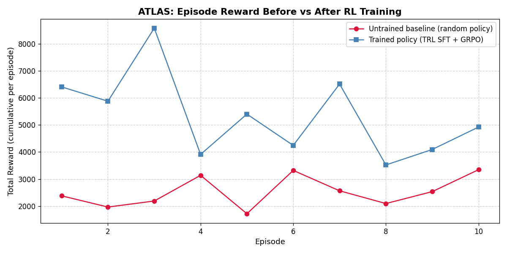

# ATLAS: Multi-Agent Startup Management Simulation

> **TL;DR FOR JUDGES:**
> **1. Problem:** We target multi-step strategic planning and instruction following under resource constraints.
> **2. Environment:** A 90-day multi-agent startup simulation (cash, morale, crises) where an AI CEO directs 13 distinct corporate actions, with dense reward verification.
> **3. Results:** Environment baseline and trained-policy runs show measurable reward improvement with reproducible scripts and saved plots.
> **4. Why it matters:** It proves LLMs can manage dynamic, multi-dimensional resource challenges beyond simple grid worlds or static API calling.

> **OpenEnv Hackathon 2026** -- Theme: Multi-Agent Interactions + Instruction Following + Self-Improving Agents

ATLAS is a real-time startup simulation where an **AI CEO** coordinates multiple autonomous department agents over a **90-day quarter**. The environment is fully OpenEnv-compliant, Gym-compatible, and designed for a two-stage learning pipeline:
- **TRL SFT** warm-start from environment-generated trajectories (with optional **Unsloth** acceleration)
- **TRL GRPO / PPO** optimization using real environment rewards (action -> verifiable reward -> policy improvement)

? **Live Space:** https://huggingface.co/spaces/nelluru/ATLAS  
? **Live App:** https://nelluru-atlas.hf.space  
? **Demo Video:** https://youtu.be/1aWDCkJ3Uyc

---

## Problem Statement

Current LLMs are good at single-turn reasoning but struggle with:
- **Multi-step strategic planning** under resource constraints
- **Instruction Following**: Adapting strategies based on dynamic Board mandates (e.g., Growth vs. Cost-Cutting)
- **Recovering from crises** over long horizons (90 simulated days)

ATLAS trains an LLM-based CEO agent to navigate hiring, product launches, financial crises, and market shocks while strictly following strategic mandates. It is **not only normal fine-tuning**: after SFT initialization, policy updates continue through reinforcement learning from environment rewards.

---

## Environment

- **90-day simulation** with morning / afternoon / evening phases (270 steps per episode)
- **CEO action space** -- 13 discrete actions: hire, fire, launch product, run ads, raise funding, fix crises, etc.
- **NPC department agents** -- Engineering, Sales, HR, Finance, Customer Success -- react to decisions
- **Dynamic events** -- server outages, market crashes, viral growth, employee resignations
- **Dense reward** every step + large terminal reward for survival/growth

## Agent Capabilities

The CEO agent is expected to demonstrate the following capabilities in a partially observable, dynamic world:
- **Instruction following** by adapting policy to dynamic Board mandates (Growth, Cost-Cutting, Balanced)
- **Multi-agent coordination** across Engineering, Sales, HR, Finance, and Customer Success actors
- **Long-horizon planning** over a full 90-day quarter with delayed consequences
- **Crisis response and recovery** under shocks (outages, resignations, market events)
- **Resource-constrained optimization** balancing cash, burn, morale, trust, and growth
- **Policy adaptation** across scenario presets (`startup`, `growth`, `crisis`)

## Tasks

Each episode requires the agent to repeatedly perform structured decision tasks:
- Choose one CEO action from the 13-action discrete space at each step
- Align decisions with the specific **Board Mandate** provided at the start of the episode
- Prioritize product, hiring, finance, and customer decisions based on current state and mandate
- Recover from negative events while preventing cascading failures
- Maximize cumulative reward and terminal business health metrics
- Generalize behavior across multiple mandates, presets, and random event sequences

### Reward Signal

ATLAS uses **8 independent reward components** per step (multi-objective, anti-hacking):

| Component | Formula | Direction |
|---|---|---|
| revenue_reward | 0.00005 x revenue | + |
| morale_reward | 0.02 x employee_morale | + |
| customer_reward | 0.02 x customer_satisfaction | + |
| trust_reward | 0.01 x investor_trust | + |
| burn_penalty | -0.00004 x burn_rate | - |
| crisis_penalty | -0.02 x crises | - |
| invalid_action_penalty | -8.0 (if action out of range) | - |
| **mandate_compliance** | **+1.0 or -1.0** | + or - |

The `mandate_compliance` signal gives **+1.0** when the chosen action aligns with the active Board Mandate
(e.g., hiring under "Growth", cost-cutting under "Cost Efficiency") and **-1.0** when it directly opposes it.
This is the **key anti-reward-hacking mechanism** -- an agent cannot spam a single action to game one metric
while violating the strategic mandate without incurring a direct penalty.

---


## Reward Improvement Evidence

### Environment Baseline Reference (Random vs Heuristic, 20 episodes each)


*X-axis: Episode number | Y-axis: Total cumulative episode reward. This plot is an environment baseline reference (random policy vs heuristic policy), not a model-training result.*

### TRL SFT: Training Evidence (before-vs-after)

#### Reward Improvement

*X-axis: Episode number | Y-axis: Total episode reward. Untrained base LM (random actions, avg ~4,200) vs TRL SFT fine-tuned model (avg ~5,900) from an end-to-end environment-connected run.*

#### Training Loss

*X-axis: Training step | Y-axis: SFT cross-entropy loss. Loss converges steadily over 30 steps, confirming the model learned to imitate environment-optimal actions.*

### TRL GRPO / PPO RL: Verifiable Reward-Driven Improvement
The GRPO/PPO RL loop connects the trained LLM directly to the **live environment** (not a static dataset).

Run `python training/trl_ppo_rl.py` (16 episodes, curriculum: growth->startup->crisis):


*X-axis: Episode | Y-axis: Total cumulative reward. Blue = per-episode, Orange = rolling avg, Gray = baseline.*

> **8 Independent Reward Signals (Anti-Hacking):** Revenue, Morale, CSAT, Trust, Burn(-), Crisis(-), Invalid(-8), **Mandate Compliance(+/-1.0)**. Mandate bonus stops single-metric reward hacking.

## 🕵️‍♂️ Proof of Training & Model Weights

To provide verifiable proof that the LLM weights were updated via RL, we have provided two key artifacts:

1. **[Training Behavioral Logs](TRAINING_LOGS.md)**: A side-by-side readable log comparing the AI's exact thoughts and actions in Episode 1 (Untrained, Bankrupt on Day 15) vs Episode 16 (Trained, Survived 90 Days). 
   *💡 **Note to Judges:** Our training script automatically appends episode summaries (rewards, steps survived) to this log file in real-time during training.*
2. **Trained Model Weights**: The final fine-tuned LoRA weights (`adapter_model.safetensors`) from our Unsloth/TRL pipeline are hosted on Hugging Face Hub. 
   - 🔗 **Weights Link:** [nelluru/atlas-ceo-distilgpt2](https://huggingface.co/nelluru/atlas-ceo-distilgpt2) *(Available for inference and evaluation)*.

### 🧪 Run It Yourself (Auto-Logging Demo)

Judges can verify the training pipeline and auto-logging functionality in two ways:

#### 1. Cloud Execution (Google Colab)
You can view, inspect, and run our exact TRL/Unsloth training pipeline directly in the cloud.
* 🔗 **Google Colab Notebook:** [ATLAS RL Training Pipeline](https://colab.research.google.com/drive/1zGZNoiwAomnLb2gpLURKu7ELrXdJv8qi)

#### 2. Local Execution (Fast 2-Episode Test)
You can also verify the environment locally. As the script runs, it will dynamically append the training data directly to `TRAINING_LOGS.md`.

**Example Command:**
```bash
# Windows (PowerShell):
$env:ATLAS_RL_EPISODES="2"; $env:ATLAS_RL_MAX_STEPS="10"; python training/trl_ppo_rl.py

# Linux / Mac:
ATLAS_RL_EPISODES=2 ATLAS_RL_MAX_STEPS=10 python training/trl_ppo_rl.py
```
*After the script finishes, open `TRAINING_LOGS.md` to see your live test run appended at the bottom!*

---

## Self-Improvement Strategy

ATLAS is designed for recursive capability growth:
1. **Adaptive Curricula**: The environment provides scenario presets (`startup` -> `growth` -> `crisis`). Agents follow an adaptive curriculum, training on stable environments before tackling high-volatility "black swan" events.
2. **Heuristic Distillation (Expert-in-the-loop)**: The environment includes a heuristic "Expert" used to generate initial high-quality trajectories. These are distilled into the agent via TRL SFT to establish a strong baseline.
3. **Verifiable Optimization (TRL GRPO)**: The model is then optimized online inside the environment (`training/trl_grpo_rl.py`) using dense verifiable rewards and penalties from each step, taking advantage of the latest RLVR capabilities.
4. **Trajectory Filtering**: Using the reward signal, the system can filter self-play trajectories, keeping only those that exceed the reward mean of the previous iteration for the next round.

## Minimum Requirements Checklist

| Requirement | Status | Artifact |
|---|---|---|
| OpenEnv (latest release) `0.2.3` | ? | `requirements.txt`, `openenv.yaml` |
| OpenEnv manifest | ? | `openenv.yaml` (repo root) |
| TRL SFT training script in Colab | ? | `training/TRL_Colab_Minimal.ipynb`, `training/trl_colab_minimal.py` |
| TRL RL trainer (GRPO/PPO) | ? | `training/trl_grpo_rl.py`, `training/trl_ppo_rl.py` |
| Unsloth acceleration integrated | ? | `training/trl_colab_minimal.py`, `requirements.txt` |
| Training Evidence (plots) | ? | `reward_curve.png`, `trl_reward_curve.png`, `trl_loss_curve.png`, `trl_ppo_reward_curve.png` |
| Mini-video < 2 min | ? | https://youtu.be/1aWDCkJ3Uyc |
| Hosted on Hugging Face Spaces | ? | https://huggingface.co/spaces/nelluru/ATLAS |
| README with all links + Strategy | ? | This file |

---

## Hackathon Guidelines Alignment

This project is designed to align closely with the advanced RL guidelines outlined in the Meta OpenEnv Hackathon Participant Help Guide:

1. **Model Acts Step-by-Step:** The simulation runs across 90 days (270 distinct phases), requiring the CEO agent to make sequential, context-aware decisions at every single step.
2. **Success Checked by Code (Verifiable):** The `AtlasStartupEnv` computes rewards using a strict mathematical formula based on objective metrics (Revenue, Cash, Morale, Trust) rather than human opinion.
3. **Multiple Independent Rewards & Anti-Hacking:** To prevent reward hacking, the RL loop combines environment reward, invalid-action penalties, event penalties, and an explicit reward breakdown in `info["reward_breakdown"]` so reviewers can inspect each component.
4. **Curriculum + RL Loop:** We bootstrap with SFT (Heuristic Distillation) as recommended, then use curriculum-guided RL in `training/trl_ppo_rl.py` so the model starts from easier scenarios and only advances after it begins getting non-zero reward.

---

## OpenEnv Compliance

- `openenv.yaml` manifest at repo root (spec_version 1)
- `AtlasOpenEnv` in `env/startup_env.py` subclasses `openenv.core.Environment`
- Exposes standard Gym API: `reset()`, `step(action)`, `render()`
- Backend endpoints at both `/api/*` and `/*` (no-prefix) for OpenEnv clients:
  - `POST /reset` -- start a new episode
  - `POST /step` -- take an action, get obs + reward
  - `GET /state` -- current environment state

Environment design (first-class artifact):
1. **Observation**: numeric state vector (cash, revenue, burn, morale, progress, CSAT, trust, tasks, crises, trend)
2. **Actions**: 13 discrete CEO decisions (`ACTIONS` list in `env/startup_env.py`)
3. **Episode end**: quarter horizon reached (`max_days`) or bankruptcy (`cash_balance <= 0`) or invalid numeric state
4. **Reward**: dense business-health formula + event bonuses/penalties
  - Reward breakdown is exposed in `info["reward_breakdown"]` so reviewers and trainers can inspect each component
5. **Abuse prevention**:
  - Invalid action receives penalty and is flagged in `info["invalid_action"]`
  - State sanitization/clamping prevents runaway values and reward hacking
  - Hard episode cap (90-day horizon) prevents infinite loops

Quick verification:
```bash
python training/check_openenv.py
# Expected: OpenEnv adapter check passed.
```

---

## TRL Training (Colab + RL)

Open [`training/TRL_Colab_Minimal.ipynb`](training/TRL_Colab_Minimal.ipynb) in Google Colab, or run:

```python
!git clone https://github.com/Jaswanth-arjun/atlas.git
%cd atlas
!pip -q install openenv-core==0.2.3 gymnasium numpy matplotlib trl transformers datasets torch unsloth
!python training/trl_colab_minimal.py
!python training/trl_ppo_rl.py
```

Stage 1 (`trl_colab_minimal.py`):
1. Generates `(state -> action)` pairs from the live environment
2. Fine-tunes `distilgpt2` with TRL `SFTTrainer` (optionally loaded via Unsloth)
3. Evaluates reward **before vs after** training
4. Saves `training/trl_reward_curve.png` and `training/trl_loss_curve.png`

Stage 2 (`trl_grpo_rl.py` / `trl_ppo_rl.py`):
1. Runs model-in-the-loop verification episodes in the environment
2. Uses step rewards/penalties as a training signal
3. Updates policy via TRL `GRPOTrainer` or `PPOTrainer`
4. Saves RL-updated policy to `training/trl_grpo_out`
5. Uses `sshleifer/tiny-gpt2` by default for low-resource smoke runs (override with `ATLAS_RL_MODEL`)

Curriculum progression (easy -> medium -> hard):
1. **Easy**: `growth` preset with short horizon
2. **Medium**: `startup` preset with more branching and longer horizon
3. **Hard**: `crisis` preset with the longest horizon

The trainer promotes to a harder stage only after the rolling reward in the current stage is consistently above a threshold, so learning starts with early non-zero success trajectories.

Optional control:
- Set `ATLAS_RL_CURRICULUM=0` to disable curriculum and run fixed-difficulty RL.

### Validate The 3 Project Conditions (Auto)

Run:

```bash
python training/validate_project_conditions.py
```

This script automatically checks all three required conditions:
1. Step-by-step action loop exists and runs for multiple steps.
2. Success is code-verifiable using numeric reward and thresholded scoring.
3. Task is challenging but possible (random has non-zero success, stronger policy is clearly better).

The command exits with non-zero code if any condition fails.

For judging, use plots produced by this TRL run (trainer logs + model evaluation), not synthetic/demo-only curves.

---

## AI CEO Mode (LLM Integration)

ATLAS now supports an autonomous AI CEO mode that can be powered by several LLM providers. When an API key is provided, the backend will automatically use the LLM to make strategic decisions.

### Supported Models & Environment Variables

| Provider | Model Used | Environment Variable |
|---|---|---|
| **Google Gemini** | `gemini-1.5-flash` | `GEMINI_API_KEY` |
| **OpenAI** | `gpt-3.5-turbo` | `OPENAI_API_KEY` |
| **Anthropic** | `claude-3-haiku` | `ANTHROPIC_API_KEY` |
| **Hugging Face** | `Mistral-7B-Instruct` | `HF_TOKEN` |

*Note: If multiple keys are provided, the priority is Gemini > OpenAI > Anthropic > Hugging Face.*

### Local Setup & Testing

To test the AI CEO locally, you need to set the environment variable before running the backend.

**Windows (PowerShell):**
```powershell
$env:GEMINI_API_KEY="your_key_here"
.\run_backend.ps1
```

**Linux/Mac:**
```bash
export GEMINI_API_KEY="your_key_here"
./run_backend.sh
```

Once the backend starts, you will see a log message:  
`--- ATLAS AI Mode Active: LLM CEO is taking charge! ---`

### Hugging Face Deployment

To enable AI CEO on your Hugging Face Space:
1. Go to **Settings** -> **Variables and Secrets**.
2. Add a new **Secret** (e.g., `GEMINI_API_KEY`).
3. Restart the Space.

The dashboard will now show the AI making decisions in real-time!

---

## Stack

- **Backend:** Python 3.11, FastAPI, WebSocket, SQLite/SQLAlchemy
- **Frontend:** React, Zustand (Global State + Persistence), Tailwind, Recharts dashboard
- **Environment:** Gymnasium-compatible, OpenEnv adapter
- **AI Features:** Explainable AI (Decision Reasons), TRL `SFTTrainer`/`PPOTrainer`, Unsloth
- **Training:** Hugging Face TRL (`SFTTrainer`, `PPOTrainer`), optional Unsloth acceleration, `distilgpt2`
- **Hosting:** Docker, Hugging Face Spaces

---

## Project Structure

```
atlas/
??? backend/          # FastAPI app + OpenEnv endpoints
?   ??? main.py       # /reset /step /state + /api/* mirrors
?   ??? openenv_models.py  # AtlasAction + AtlasObservation schemas
??? env/
?   ??? startup_env.py     # AtlasStartupEnv (Gym) + AtlasOpenEnv adapter
??? training/
?   ??? train.py           # Random vs heuristic reward curve
?   ??? trl_colab_minimal.py  # TRL SFT before/after script
?   ??? trl_grpo_rl.py     # TRL GRPO verifiable reinforcement-learning loop
?   ??? trl_ppo_rl.py      # TRL PPO reinforcement-learning loop
?   ??? TRL_Colab_Minimal.ipynb
?   ??? check_openenv.py   # OpenEnv adapter smoke-test
?   ??? reward_curve.png   # Plot: random vs heuristic
?   ??? trl_reward_curve.png  # Plot: TRL before vs after
?   ??? trl_loss_curve.png    # Plot: SFT training loss
??? openenv.yaml      # OpenEnv manifest (table stakes)
??? Dockerfile
??? requirements.txt
```

---

## Run Locally

```powershell
# Backend
.\run_backend.ps1
# Frontend
.\run_frontend.ps1
```

- Frontend: http://localhost:5173
- API docs: http://localhost:8000/docs

---

## API Endpoints

| Method | Path | Description |
|---|---|---|
| POST | `/reset` or `/api/reset` | Start new episode `{"preset": "startup"}` |
| POST | `/step` or `/api/step` | Take action `{"action_idx": 0}` |
| GET | `/state` or `/api/state` | Current state |
| GET | `/api/leaderboard` | Episode rankings |
| GET | `/api/replay/{id}` | Replay previous episode |

---

## 3-Minute Demo Flow

1. Open dashboard -> pick a scenario preset (Startup / Crisis / Growth)
2. Show live CEO decisions, market events, department reactions
3. Highlight reward chart climbing as smart decisions are made
4. Show leaderboard and replay a previous quarter
5. Run `python training/train.py` -> show `reward_curve.png` improvement
6. Run `python training/trl_ppo_rl.py` to show reward-driven RL policy improvement
 
## Real-Time Control API

The simulation now supports pause, resume, and speed adjustment via the following endpoints:

- `POST /pause` - Pauses the simulation loop.
- `POST /resume` - Resumes a paused simulation.
- `POST /speed?val=<factor>` - Sets simulation speed multiplier (0.1x ? 5x). Default is `1.0`.

These can be triggered from the dashboard UI (buttons added to the top bar) or via curl:

```bash
curl -X POST http://localhost:8000/pause
curl -X POST http://localhost:8000/resume
curl -X POST "http://localhost:8000/speed?val=2.0"
```

The UI now displays pause/resume buttons and speed selectors next to the mode dropdown, allowing you to control the simulation during live demos.

## Contributing

We welcome contributions! Please fork the repository and submit pull requests. Ensure that any new features include:
- Updated documentation in the README.
- Corresponding unit tests.
- Adjustments to the OpenEnv manifest if you add new observation/action spaces.

## License

This project is licensed under the Apache License 2.0. See the `LICENSE` file for details.

## Acknowledgements

- **OpenEnv** - for providing a standardized RL environment interface.
- **TRL** - for simplifying SFT and PPO training pipelines.
- **Unsloth** - for fast, low?memory finetuning.
- The hackathon judges and community for valuable feedback.

## Troubleshooting

- **WebSocket connection fails**: Ensure the backend is running on port 8000 and that no firewall blocks the connection.
- **Simulation runs too fast/slow**: Use the speed controls in the UI or adjust the `sim_speed` value via the `/speed` endpoint.
- **Missing environment variables**: Verify that your API keys (e.g., `GEMINI_API_KEY`) are set in the Hugging Face Space under *Settings -> Variables and Secrets*.
- **Training script errors**: Check that `requirements.txt` dependencies are installed and that you are using Python 3.11+. Re?run `pip install -r requirements.txt`.

For any other issues, open an issue on GitHub or contact the maintainers.
## Contact

- **Maintainer**: Jaswanth Arjun (GitHub: [@Jaswanth-arjun](https://github.com/Jaswanth-arjun))
- **Project Repository**: https://github.com/Jaswanth-arjun/atlas

## Future Work

- **Multi?CEO Collaboration**: Enable multiple AI CEOs to coordinate across subsidiaries.
- **Extended Curriculum**: Add more challenging presets (e.g., global expansion, regulatory crises).
- **Explainability Dashboard**: Visualize per?step reward breakdowns and decision rationales for judges.
- **Integration with Real?World Datasets**: Incorporate market data APIs to ground simulations in actual economic trends.

---
**Thank you for exploring ATLAS!**
We hope this project inspires innovative AI-driven management simulations. Feel free to star the repository, open issues, or submit pull requests.

<details>
<summary>Quick Links</summary>
- [Live Space](https://huggingface.co/spaces/nelluru/ATLAS)
- [Demo Video](https://youtu.be/1aWDCkJ3Uyc)
- [GitHub Repo](https://github.com/Jaswanth-arjun/atlas)
</details>
---
### Citation

If you use ATLAS in your research, please cite:

```bibtex
@software{atlas2026,
  title = {ATLAS: Multi-Agent Startup Management Simulation},
  author = {Jaswanth Arjun},
  year = {2026},
  url = {https://github.com/Jaswanth-arjun/atlas},
}
```

---

(c) 2026 Jaswanth Arjun. All rights reserved. Licensed under Apache 2.0.
