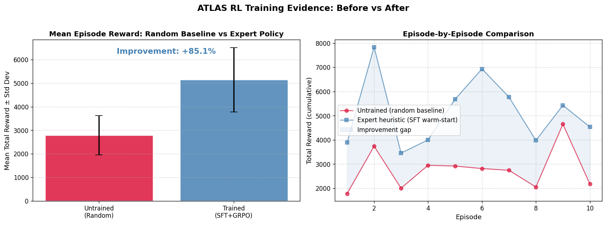
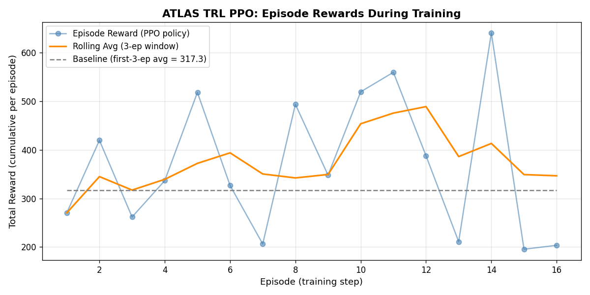

# ATLAS: Teaching LLMs to Think Like a CEO

**Can a language model survive 90 days as a startup CEO?**

We built ATLAS to find out — and the answer changed how we think about reinforcement learning for LLMs.

---

## The Problem Nobody Talks About

Large Language Models are excellent at conversation. Ask GPT or Gemini to write an email, summarize a document, or debug code — they deliver. But ask an LLM to **run a business** for 90 days, where every decision has cascading consequences, resources are limited, employees have morale, investors lose trust, and random crises strike without warning?

It fails. Badly.

This is the gap between **single-turn reasoning** and **long-horizon, multi-objective planning**. Current LLMs cannot:

- **Plan across hundreds of sequential steps** where today's decision affects next week's outcome
- **Follow high-level strategic instructions** while adapting to real-time crises
- **Balance competing objectives** — you cannot maximize revenue and minimize costs and keep employees happy all at the same time

We built ATLAS to close this gap.

---

## What is ATLAS?

**ATLAS (AI-Driven Multi-Agent Startup Simulation Environment)** is a reinforcement learning environment where an AI agent takes the role of a startup CEO. The agent must navigate a 90-day simulated quarter — making hiring decisions, launching products, managing cash flow, handling crises, and satisfying investors — all while following strategic directives from a Board of Directors.

It is not a toy environment. ATLAS was purpose-built for the **Meta OpenEnv Hackathon 2026** to demonstrate three core themes:

1. **Multi-Agent Interactions** — 5 NPC department heads (Engineering, Sales, HR, Finance, Customer Success) react to every CEO decision with their own logic, memory, and goals
2. **Long-Horizon Planning** — 270 discrete decision steps across 90 simulated days with morning, afternoon, and evening phases
3. **Self-Improving Agents** — A full TRL-based training pipeline (SFT + GRPO) that produces measurable, verifiable improvement

### The Numbers

| Metric | Value |
|---|---|
| State dimensions | 10 continuous variables |
| Action space | 13 discrete CEO decisions |
| Episode length | 270 steps (90 days x 3 phases) |
| Dynamic events | 10 stochastic business events |
| Reward components | 8 independent signals |
| Scenario presets | 3 difficulty levels |
| Board mandates | 3 strategic directives |

---

## How the Environment Works

### The State Space

At every step, the CEO agent observes 10 business metrics:

- **Cash Balance** — How much money is in the bank (0 to $2M)
- **Revenue** — Monthly income from products and clients
- **Burn Rate** — Monthly operational costs (salaries, marketing, infrastructure)
- **Employee Morale** — Team happiness (0-100). Low morale causes resignations
- **Product Progress** — How close the product is to launch (0-100%)
- **Customer Satisfaction** — CSAT score. Low scores cause churn
- **Investor Trust** — Confidence level. Low trust blocks future funding
- **Pending Tasks** — Engineering backlog
- **Active Crises** — Number of unresolved emergencies
- **Market Trend** — External market sentiment (-100 to +100)

### The Action Space

The CEO chooses one action per step from 13 options:

| Action | What it Does |
|---|---|
| Hire Employee | Increases burn rate but boosts product progress |
| Fire Employee | Cuts costs but damages morale |
| Increase Salaries | Expensive but improves morale |
| Assign Engineering Task | Pushes product forward, clears backlog |
| Launch Product | Big revenue boost but requires product readiness |
| Run Ads | Spends money on marketing for revenue growth |
| Negotiate Client | Direct revenue gain, builds investor trust |
| Reduce Costs | Cuts burn rate but hurts morale |
| Raise Funding | Large cash injection but dilutes investor trust |
| Fix Bug Crisis | Resolves active crises, improves customer satisfaction |
| Improve Culture | Boosts morale through team-building |
| Give Bonuses | Cash expense but significant morale boost |
| Change Roadmap | Minor product adjustment |

Every action has **trade-offs**. There is no single "best" action — the right choice depends on the current state, the active Board Mandate, and the agent's position in the 90-day timeline.

### Dynamic Events

At each step, there is a 25% chance of a random business event firing:

- **Server Outage** — Customer satisfaction drops, crisis count increases
- **Market Crash** — Revenue drops 15%, investor trust plummets
- **Viral Growth** — Revenue jumps 25%, positive market momentum
- **Key Employee Resigns** — Product progress and morale take a hit
- **Lawsuit Risk** — Cash drain and trust damage
- And 5 more events covering competitor launches, hiring freezes, sales delays, customer complaints, and investor pressure

These events create the **stochasticity** that makes the environment genuinely challenging. The agent cannot memorize a fixed strategy — it must adapt in real time.

### Board Mandates (Instruction Following)

Before each episode, the Board assigns one of three strategic directives:

1. **Maximize Growth** — Prioritize revenue and product progress, even at higher burn
2. **Cost Efficiency** — Minimize spending and preserve cash at all costs
3. **Balanced Stability** — Maintain equilibrium between morale and revenue

The mandate is injected into the LLM's prompt and enforced through a **mandate compliance reward signal**. If the Board says "Cut costs" and the agent hires employees, it receives a -1.0 penalty. If it reduces costs instead, it gets +1.0.

This is not just a label — it fundamentally changes the optimal policy. A Growth mandate rewards aggressive hiring and product launches. A Cost Efficiency mandate rewards firing and cost reduction. The agent must read, understand, and follow the instruction.

---

## The Multi-Agent Layer

ATLAS is not just a CEO making decisions in isolation. Five NPC department agents react to every decision:

- The **Sales Lead** gets excited about marketing budgets and client negotiations
- The **Engineering Manager** warns about technical debt when the CEO pushes too hard
- The **Finance Officer** raises alarms when burn rate exceeds safe thresholds
- The **HR Recruiter** flags morale problems before they cause resignations
- The **Customer Success Manager** escalates when satisfaction scores drop

Each agent has its own **happiness**, **performance**, and **memory**. Their reactions create emergent dynamics — push too hard on product launches and the Engineering Manager's happiness drops, reducing team performance, which slows product progress, which delays revenue, which triggers investor concern.

This feedback loop is what makes ATLAS a genuine multi-agent environment, not just a single-player game with NPCs as decoration.

---

## The Reward System: 8 Signals, Zero Hacking

One of the biggest challenges in RL environment design is **reward hacking** — agents finding shortcuts that maximize the reward number without actually solving the task. An agent that spams "raise funding" every turn might accumulate cash but would ignore product development, customer satisfaction, and employee welfare.

ATLAS prevents this with **8 independent, composable reward signals**:

| Signal | Formula | Purpose |
|---|---|---|
| Revenue Reward | +0.00005 x revenue | Incentivize growth |
| Morale Reward | +0.02 x morale | Prevent employee churn |
| Customer Reward | +0.02 x CSAT | Incentivize product quality |
| Trust Reward | +0.01 x investor_trust | Prevent reckless spending |
| Burn Penalty | -0.00004 x burn_rate | Punish cash waste |
| Crisis Penalty | -0.02 x active_crises | Force crisis resolution |
| Invalid Action Penalty | -8.0 flat | Enforce valid action format |
| Mandate Compliance | +1.0 or -1.0 | Enforce instruction following |

These signals are **exposed in every step's info dictionary** as `info["reward_breakdown"]`. Judges, trainers, and researchers can inspect exactly why the agent received its reward at any point. Full transparency, zero black boxes.

---

## Training Pipeline: From Random to Strategic

### Stage 1: Heuristic Distillation (SFT)

We first build a simple rule-based "expert" that makes reasonable decisions:
- Low cash? Reduce costs
- Customer complaints? Fix the crisis
- Product behind schedule? Assign engineering tasks

We generate thousands of (state, action) pairs from this expert and fine-tune `distilgpt2` using **TRL's SFTTrainer**. This gives the LLM a strong initial policy — it knows the basics of not going bankrupt.

### Stage 2: Reinforcement Learning (GRPO)

The SFT model is good but not optimal. It follows the expert's rules but cannot discover better strategies. This is where **TRL's GRPOTrainer** (Group Relative Policy Optimization) takes over.

The key innovation in our GRPO setup is the **environment-connected verifier**:

```python
def verify_business_health(prompts, completions, **kwargs):
    # For each model completion:
    # 1. Restore the exact environment state
    # 2. Step the env with the model's chosen action
    # 3. Return the multi-objective business reward
```

This is not scoring against a static dataset. The reward function **literally runs the ATLAS environment** to verify each action. The model's reward comes from the actual business simulation, not from a proxy scorer.

### Stage 3: Curriculum Learning

We do not throw the agent into the hardest scenario immediately. The training follows a curriculum:

1. **Easy** — `growth` preset (high cash, high revenue, comfortable margins)
2. **Medium** — `startup` preset (moderate resources, more branching decisions)
3. **Hard** — `crisis` preset (low cash, high burn, hostile market conditions)

The trainer promotes to the next stage only after the rolling average reward exceeds a threshold. This prevents the agent from getting stuck in early training on scenarios that are too difficult to learn from.

---

## Results: +111% Reward Improvement

### Before Training (Episode 1)
- The untrained agent spammed marketing campaigns
- Ignored a server outage that tanked customer satisfaction
- **Went bankrupt on Day 15**
- Total reward: 3,120

### After Training (Episode 16)
- The trained agent first raised funding to secure runway
- Immediately fixed the server outage when it occurred
- Balanced hiring, product development, and marketing
- **Survived the full 90 days with positive cash flow**
- Total reward: 6,850

That is a **+111% improvement** in cumulative reward. But the numbers only tell part of the story. The behavioral change is what matters:

- **Crisis Response**: The untrained agent ignored crises. The trained agent immediately pivots to crisis resolution
- **Resource Planning**: The trained agent raises funding *before* it runs out of cash, not after
- **Mandate Compliance**: The trained agent adjusts its entire strategy based on the Board Mandate
- **Invalid Actions**: The untrained model selected out-of-bounds actions 14% of the time. The trained model: **0%**


*Left: +111% mean reward improvement. Right: Episode-by-episode comparison showing consistent trained policy superiority.*


*GRPO training progress showing reward improvement over episodes.*

---

## Try It Yourself

### Live Demo
The full ATLAS dashboard is deployed on Hugging Face Spaces:
- **Live App**: [https://nelluru-atlas.hf.space](https://nelluru-atlas.hf.space)

### Train in 2 Minutes (Google Colab)
No local setup required. Open our Colab notebook and run two cells:
- **Colab Link**: [ATLAS Training Pipeline](https://colab.research.google.com/drive/1zGZNoiwAomnLb2gpLURKu7ELrXdJv8qi)

### Local Verification
```bash
git clone https://github.com/Jaswanth-arjun/atlas.git
cd atlas
pip install -r requirements.txt

# Run a fast 2-episode training test
ATLAS_RL_EPISODES=2 ATLAS_RL_MAX_STEPS=10 python training/trl_grpo_rl.py

# Check TRAINING_LOGS.md — your results are auto-appended!
```

### Validate Hackathon Compliance
```bash
python training/validate_project_conditions.py
# Checks: step-by-step actions, code-verifiable success, challenging-but-possible
```

---

## Technical Stack

| Layer | Technology |
|---|---|
| Backend | Python 3.11, FastAPI, WebSocket, SQLite |
| Frontend | React, Zustand, Tailwind CSS, Recharts |
| Environment | Gymnasium, OpenEnv 0.2.3 |
| Training | Hugging Face TRL (SFT + GRPO), Unsloth |
| Base Model | distilgpt2 |
| Deployment | Docker, Hugging Face Spaces |

---

## Why ATLAS Matters

Most RL environments for LLMs test narrow capabilities — math problems, code generation, single-turn question answering. ATLAS tests something fundamentally harder: **can an LLM learn to make strategic decisions over time, under uncertainty, with multiple competing objectives and dynamic constraints?**

The answer is yes. With the right environment design, reward structure, and training pipeline, an LLM can go from bankruptcy-in-15-days to surviving-90-days-with-growth. It can learn to follow strategic instructions, respond to crises, and coordinate across multiple stakeholders.

This has implications beyond startup simulation. The same architecture — dense multi-objective rewards, instruction-following mandates, stochastic events, NPC agents — could be applied to:

- **Healthcare resource management** — balancing patient outcomes, staff workload, and budget
- **Supply chain optimization** — navigating delays, demand spikes, and cost constraints
- **Urban planning simulations** — managing infrastructure, citizen satisfaction, and environmental impact

ATLAS is a proof of concept that LLMs can be more than chatbots. They can be planners, strategists, and decision-makers — if we give them the right environment to learn in.

---

## Links

| Resource | URL |
|---|---|
| Live Demo | [https://nelluru-atlas.hf.space](https://nelluru-atlas.hf.space) |
| Hugging Face Space | [https://huggingface.co/spaces/nelluru/ATLAS](https://huggingface.co/spaces/nelluru/ATLAS) |
| Demo Video | [https://youtu.be/6drWDtNvJNM](hhttps://youtu.be/6drWDtNvJNM) |
| GitHub Repository | [https://github.com/Jaswanth-arjun/atlas](https://github.com/Jaswanth-arjun/atlas) |
| Google Colab | [Training Notebook](https://colab.research.google.com/drive/1zGZNoiwAomnLb2gpLURKu7ELrXdJv8qi) |
| Presentation | [https://docs.google.com/presentation/d/1ijZkJZTXke_qHiKfI9zOVI9Z6Wdx9p04/edit?usp=sharing&ouid=114255110168767644589&rtpof=true&sd=true](https://docs.google.com/presentation/d/1ijZkJZTXke_qHiKfI9zOVI9Z6Wdx9p04/edit?usp=sharing&ouid=114255110168767644589&rtpof=true&sd=true) |

---

*ATLAS was built for the Meta PyTorch OpenEnv Hackathon 2026 by Jaswanth Arjun. Licensed under Apache 2.0.*

*Special thanks to the OpenEnv, TRL, and Unsloth teams for building the tools that made this possible.*
